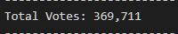
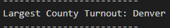
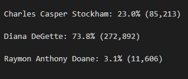
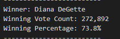

# Election_Analysis

## Overview of Election-Audit

The purpose of this election-audit analysis was to summarise voting data for Jefferson, Denver, and Arapahoe counties in Colorado. The summerized data was to show the total votes across the 3 counties, the votes and voting percentages by county, the county with the largest turnout, the votes and percentages by candidate, and finally, the winning candidate and their vote count and percentage of votes.

## Election-Audit Results

The results of the analysis are presented in the below list:
- The number of votes cast in this congressional election: 
- Breakdown by county: 
- County with largest turnout: 
- Breakdown by candidate: 
- Winning candidate statistics: 

## Election-Audit Summary

This scirpt can readily be applied to more general election data. But as the number of districs analyzed increased (the limit would be in a federal election with 453 congressional distrcits), it would be less and less informative to print all the district vote counts to the console. One potential change would be to sort all the county votes in descending order and then to only print say the top 5 or 3. Similarily in a larger election we might only want to print relevent candidates, say the top 2 (likely the democrat and republican candidates). To accomplish this we use the following function to extract the top n entries from a dictionary and then return the string to print:
