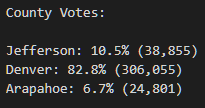

# Election_Analysis

## Overview of Election-Audit

The purpose of this election-audit analysis was to summarise voting data for Jefferson, Denver, and Arapahoe counties in Colorado. The summarized data was to show the total votes across the 3 counties, the votes and voting percentages by county, the county with the largest turnout, the votes and percentages by candidate, and finally, the winning candidate and their vote count and percentage of votes.

## Election-Audit Results

The results of the analysis are presented in the below list:
- The number of votes cast in this congressional election: 
- Breakdown by county: 
- County with largest turnout: 
- Breakdown by candidate: 
- Winning candidate statistics: 

## Election-Audit Summary

This script can readily be applied to more general election data. But as the number of districts analyzed increased (the limit would be in a federal election with 453 congressional districts), it would be less and less informative to print all the district vote counts to the console. One potential change would be to sort all the county votes in descending order and then to only print say the top 5 or 3. Similarly in a larger election we might only want to print relevant candidates, say the top 2 (likely the democrat and republican candidates). We can address both issues using the function `topEntries(n,d)` which is not copied here for formatting reasons but can be viewed [here.](./election_analysis/PyPoll_Challenge.py#L42) We then modify the code to print the `topEntries` of the county_votes and candidate_votes instead of looping through and printing all of them. A modification which we need to make to allow the code to run on any election data is to replace our hard coded value which we use to initialize largest county by turnout (see [here](election_analysis/PyPoll_Challenge.py#L123)) since there is no guarentee that jeffereson county will be in the data we would want to replace this line with:
```python
largest_county_votes = county_votes[list(county_votes)[0]]
```
this would assign the largest_county_votes variable to be the value at the first key in the county_votes dictionary instead of the value at the key "Jefferson".
